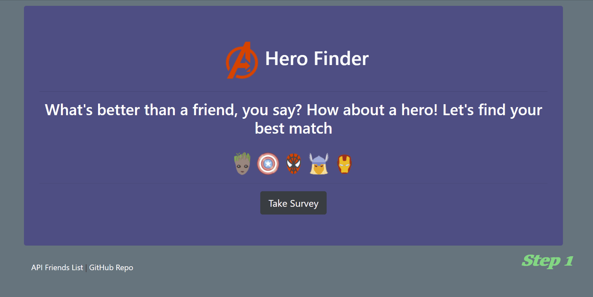
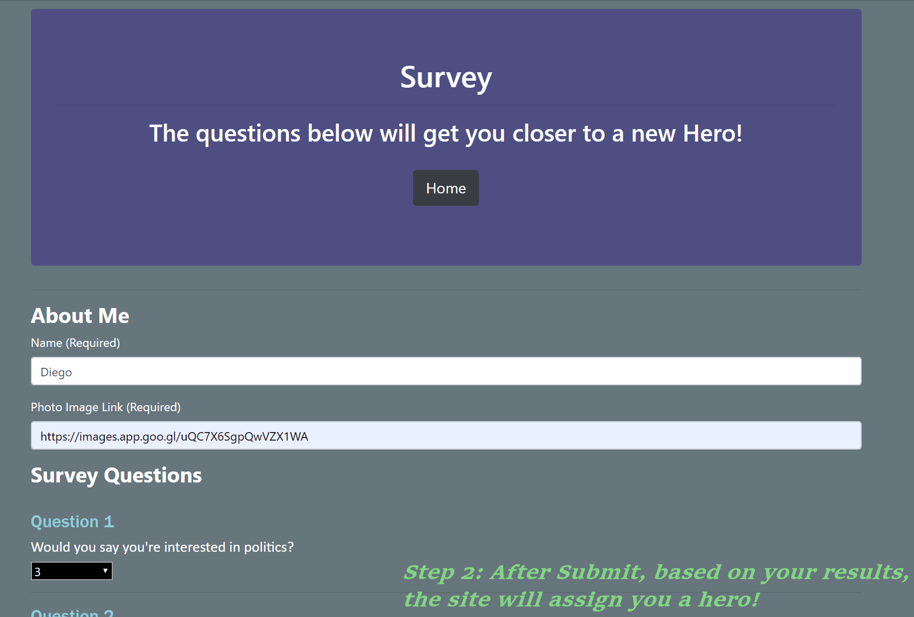

# HeroFinder :see_no_evil: :hear_no_evil: :speak_no_evil:
***

## Details :eyes:

You are going to fill out a little questionaire :clipboard: that will calculate the results, based off that, you will be assigned a hero! :fireworks: 

### Lets's see it in action :vhs: :clapper:

**By selecting "Take Survey" our routes that we set up in our htmlRoutes.js file will redirect us to our Survey page** :airplane:
***

**I used a modal to display the image of our hero to the user** :tada:
***
#### Technology Used: 
* Javascript
* nodeJS
* Bootstrap
* HTML
* CSS
* NodeJS
* npm packages:
	- [mysql](https://www.npmjs.com/package/mysql)
	- [express](https://www.npmjs.com/package/express)
	- [path](https://www.npmjs.com/package/path)

